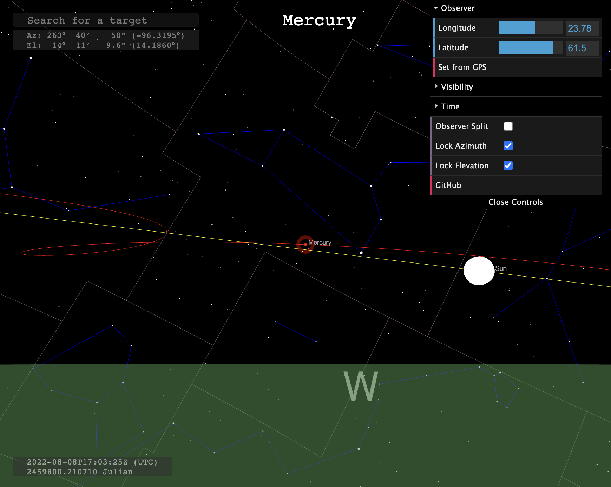
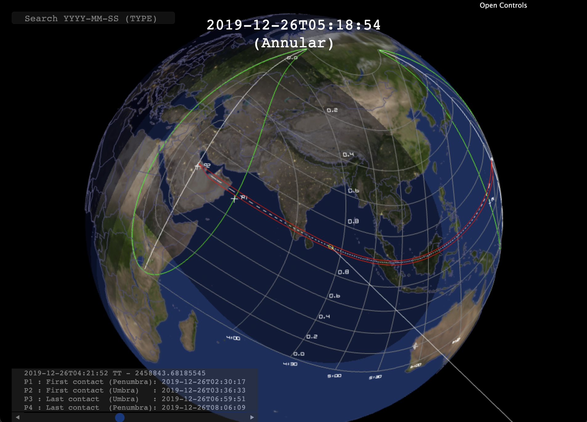
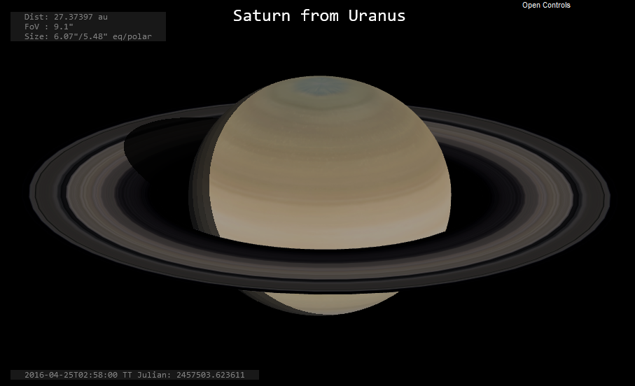

# orbits.js
Javascript library for positional astronomy.

The library has been implemented mainly to facilitate my hobby with Javascript visualizations and positional astronomy.  The code is somewhat poorly organized into relatively stand-alone methods but is completely self-contained and written in pure Javascript. 

The library implements:
* Time Correlations between TT, UT1 and TAI.
* Coordinate transformations between the following frames:
    * Heliocentric Ecliptic
    * Geocentric Ecliptic
    * J2000 (equal to ICRS/FK5)
    * Mean-of-Date (MoD)
    * True-of-Date (ToD)
    * Pseudo-Earth-Fixed (PEF)
    * Earth-Fixed (EFI) (equal to ITRS)
    * Local Tangent Plane - East, North, Up (ENU)
    * Perifocal frame.
* Extended Hipparcos Compilation (XHIP) stars with configurable magnitude limit.
* VSOP87A for the computation of positions of planets.
* ELP2000-82B for accurate computation of the position of the Moon with configurable truncation.
* Computation of Stellar aberration.
* Keplerian elements:
    * Solution of Kepler's equation and Perifocal positions.
    * Approximate positions of planets.
    * Osculating Keplerian elements.
    * Keplerian propagation of orbits.
* Solar Eclipses.
* Planetary satellites of Mars, Jupiter, Saturn and Uranus.

The planetary computations should match JPL Horizons with an average error of 60-300 mas depending on the planet. The error in position of the Moon w.r.t. JPL Horizons should be below 200 meters between 1900-2100. 

The JSON files are generated as follows:
* VSOP87A : npm run vsop87a
* Hipparcos : npm run xhip
* Constellation boundaries : npm run cbnd
* ELP2000-82B : npm run elp2000

Click below to execute an example of a simple application using most features of the library.

Click below for an example drawing constellations.

Click below for an example for visualization of Solar Eclipses.

Click below to execute an example of a simple application drawing visual appearance of planets.

