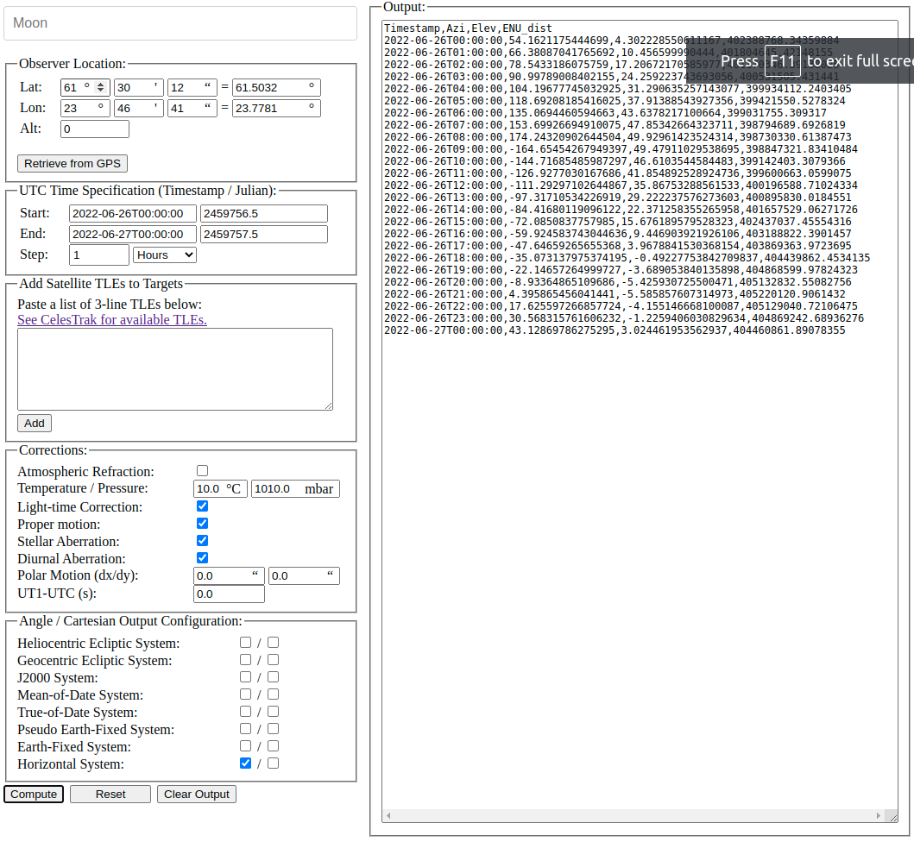

# orbits.js
Javascript library for computation of positions of stars and planets.

The library implements:
* Coordinate transformations between the following frames:
    * Heliocentric Ecliptic
    * Geocentric Ecliptic
    * J2000
    * Mean-of-Date (MoD)
    * True-of-Date (ToD)
    * Pseudo-Earth-Fixed (PEF)
    * Earth-Fixed (EFI)
* Extended Hipparchos Compliation (XHIP) stars with magnitudes below 6.
* VSOP87A for the computation of positions of planets.
* Accurate computation of the position of the Moon.
* Computation of Stellar aberration.
* Keplerian elements:
    * Approximate positions of planets.
    * Osculating Keplerian elements.
    * Keplerian propagation of orbits.

Click below to execute an example of a simple application using most features of the library.

The code used to construct the JSON files for VSOP87 and Hipparchus datasets can be found 
from the [matlab_orbits](https://github.com/vsr83/matlab_orbits/tree/main/data) repository.

